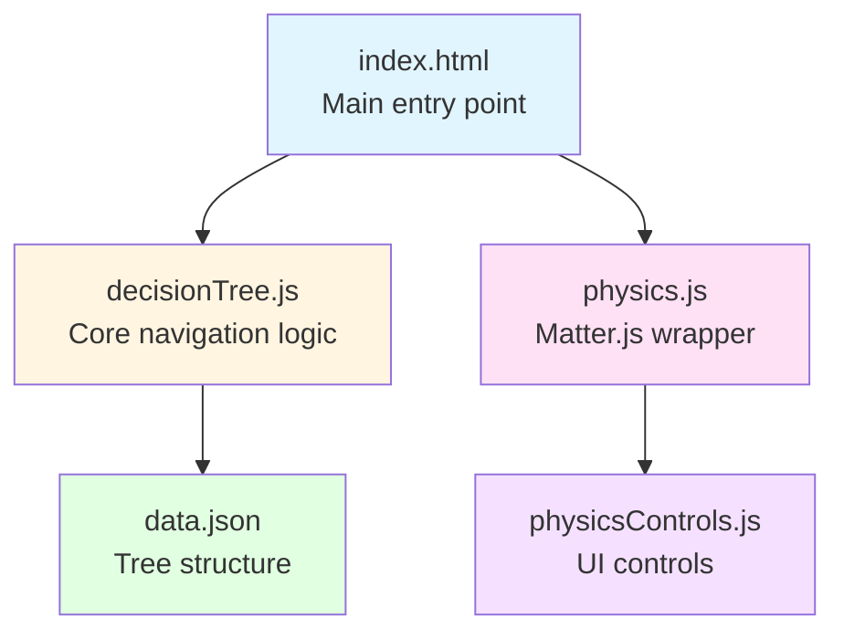

# Descriptor Selection Tool

**An interactive decision tree with physics-based visualization**

A sophisticated web application that combines graph-based navigation with 2D physics simulation. Users navigate through a multi-parent decision tree where each choice spawns a bouncing ball, creating an engaging visual representation of their path through the decision space.

  

---

## Key Features

### **Advanced Decision Tree**
- **Multi-parent, multi-child graph structure** - Nodes can have multiple parents (converging paths)
- **Navigation history system** - Full undo/redo with state tracking
- **Dynamic tree loading** - JSON-based tree structure with localStorage caching

### **Physics-Based Visualization**
- **Matter.js 2D physics engine** - Realistic ball collisions and bouncing
- **Three physics modes**:
  - **Normal Gravity**: Standard Earth-like physics with settling
  - **Reversed Gravity**: Gentle upward float (end-of-tree animation)
  - **Zero Gravity**: Perpetual motion billiard table (energy conservation)
- **Dynamic parameter control** - Real-time adjustment of gravity, friction, bounciness, ball size
- **Sin-hole effect** - Dramatic ball removal animation when navigating backward

### **Visual Design**
- **Responsive canvas rendering** - Adapts to any screen size
- **8 vibrant ball colors** - Cycling color palette for visual variety
- **Rotating text labels** - Text follows ball rotation for physical realism
- **Smooth animations** - CSS animations + physics-based motion

### **Developer-Friendly**
- **Zero build process** - Pure browser JavaScript, no compilation required
- **ES6 modules** - Clean, modern code organization
- **Comprehensive documentation** - Deep technical reference for all modules
- **Real-time parameter tweaking** - Debug and tune physics via UI controls

---

## Quick Start

```bash
# Clone or download the repository
git clone [repository-url]

# Open in browser (no build step needed)
open index.html
```

**That's it!** No npm install, no webpack, no compilation. Just open and run.

### First Run

1. Click **"Start"** to begin
2. Make choices - each adds a bouncing ball
3. Navigate with **Back** button - watch the sin-hole effect
4. Press **Tab** to toggle control panels
5. Press **Enter** for fullscreen mode
6. Reach the end to see the gravity sequence animation

---

## Documentation

### For Programmers

**[TECHNICAL_DOCUMENTATION.md](docs/TECHNICAL_DOCUMENTATION.md)** - Comprehensive technical reference

Covers:
- Complete system architecture with code-level details
- API reference for all modules (DecisionTree, PhysicsEngine, etc.)
- Data structures and JSON schema
- Physics engine deep dive (Matter.js integration, collision resolution, energy management)
- Event flow and state management patterns
- Configuration and customization guide
- Design patterns and best practices

### For Quick Reference

**[Changelog](docs/context/changelog.md)** - Version history and recent changes

---

## Architecture Overview

### Core Components



### Technology Stack

| Technology | Version | Purpose |
|------------|---------|---------|
| **Matter.js** | 0.19.0 | 2D physics simulation (rigid body dynamics) |
| **jQuery** | 3.6.0 | DOM manipulation and event handling |
| **ES6 Modules** | Native | Code organization and encapsulation |
| **Canvas API** | Native | Physics rendering and text display |
| **localStorage** | Native | State persistence and config storage |

### File Structure

```
lib/
├── decisionTree.js       (~600 lines) - Tree logic, navigation, state
├── physics.js            (~900 lines) - Physics engine, ball rendering
├── physicsControls.js    (~400 lines) - UI controls, config management
├── showHide.js           (~50 lines)  - Keyboard shortcuts
├── docsPanel.js          (~150 lines) - Documentation viewer
└── data.json             - Decision tree structure (JSON)

css/
├── dashboard.css         - Main UI styles
├── physics-controls.css  - Control panel styles
└── ...                   - Additional styling

index.html                - Entry point, DOM structure
docs/TECHNICAL_DOCUMENTATION.md - Complete technical reference
```

---

## User Interaction

### Keyboard Shortcuts

- **Tab** - Toggle control panels (physics + documentation)
- **Enter/Return** - Toggle fullscreen mode

### Mouse Controls

- **Click choices** - Navigate decision tree, add balls
- **Back button** - Undo last choice, trigger sin-hole effect
- **Restart button** - Clear all state, return to start
- **Physics toggle** - Switch between physics and static display modes
- **Sliders** - Adjust physics parameters in real-time

---

## Configuration

### Physics Parameters

The physics engine is highly configurable via the control panel (Tab key) or programmatically:

```javascript
PhysicsEngine.setConfig({
  ballSizePercent: 0.06,      // Ball size (% of screen area)
  gravity: 1.0,               // Gravity strength
  bounciness: 0.95,           // Elasticity (restitution)
  friction: 0.05,             // Surface friction
  velocityThreshold: 0.01     // Min velocity before stop
});
```

All configuration is persisted to localStorage and restored on reload.

### Decision Tree Data

Edit `lib/data.json` to customize the decision tree:

```json
{
  "initial": ["start"],
  "choices": {
    "start": {
      "choice": "Start",
      "stepTitle": "Welcome",
      "children": ["option1", "option2"]
    },
    "option1": {
      "choice": "Option 1",
      "stepTitle": "Next question?",
      "children": ["result1", "result2"]
    }
  }
}
```

**See TECHNICAL_DOCUMENTATION.md for complete JSON schema.**

---

## Physics Modes Explained

### Normal Gravity
- Standard Earth-like physics (gravity = 1.0)
- Balls bounce and gradually settle
- Used during active navigation

### Reversed Gravity (Damped)
- Gentle upward float (gravity = -0.04)
- Balls slowly rise to top
- Part of end-of-tree animation sequence

### Zero Gravity (Billiard Table)
- No gravity, no air resistance
- Perpetual motion - energy conserved indefinitely
- Friction converts linear momentum → angular momentum (spin)
- Final animation state

**Animation Sequence**: Normal (navigation) → Reversed (3s delay) → Zero Gravity (5s delay)

---

## Critical Requirement: SVG Export

**IMPORTANT**: SVG export functionality is a NON-NEGOTIABLE requirement.

Future implementations must support:
- Capturing ball positions, sizes, colors, labels
- Generating resolution-independent SVG output
- Preserving layout and styling
- Exporting as downloadable .svg file

**Why?** Print-ready quality, professional editing, mathematical precision.

---

## Debugging

### Console Logging

The application includes extensive debug logging:

```javascript
console.log("Step", step, ": Clicked", choiceId, "physicsMode:", physicsMode);
console.log("Navigation history:", navigationHistory);
console.log("⚫ COLLISION - Ball #0 [normal]:");
console.log("  Linear speed: 5.234 → 4.987 | Loss: 4.7%");
```

### Debug Features

- **Canvas border toggle** - Visualize physics boundaries (red border)
- **Energy monitoring** - Verify energy conservation: `PhysicsEngine.monitorEnergy(3000)`
- **Diagnostic check** - Log all physics state: `PhysicsEngine.diagnosticCheck()`

---

## Performance

- **Optimal ball count**: 10-30 balls for smooth 60 FPS
- **Maximum recommended**: ~50 balls before performance degrades
- **Physics updates**: Fixed 60 Hz timestep (16.667ms)
- **Collision detection**: O(n log n) via Matter.js spatial partitioning

---

## Browser Support

**Minimum requirements**:
- ES6 modules (import/export)
- Canvas 2D context
- Fetch API
- localStorage
- CSS animations

**Tested on**:
- Chrome/Edge 90+
- Firefox 88+
- Safari 14+

---

## Version History

### v2.0 - August 28, 2026 (Current)
- Navigation history system with `hadBall` tracking
- Sin-hole falling effect for ball removal
- Text labels follow falling balls
- Improved back button reliability

### v1.5 - June-July 2026
- Three physics modes (Normal, Reversed, Zero Gravity)
- Real-time parameter controls
- Configuration persistence

### v1.0 - June 2025
- Initial release
- Core decision tree + physics visualization

**[See changelog.md for detailed version history](docs/context/changelog.md)**

---

## For Developers

### Code Quality

- **Modular architecture** - Clear separation of concerns
- **Design patterns** - Module pattern, constructor pattern, event-driven
- **Error handling** - Validation at boundaries, descriptive error messages
- **State management** - Single source of truth with invariants

### Contributing Guidelines

1. Read **TECHNICAL_DOCUMENTATION.md** first
2. Follow existing code patterns
3. Maintain state invariants (`selectList.length === balls.length`)
4. Test changes in all three physics modes
5. Add console logging for state changes
6. Document new configuration parameters

### Key Architectural Principles

- **State Invariant**: `selectList.length === balls.length === triggeredBalls.size`
- **Unidirectional Data Flow**: Data → State → View → Events → State
- **Event-Driven**: Loose coupling between components
- **Configuration-Based**: All parameters adjustable without code changes

**For complete technical details, see [TECHNICAL_DOCUMENTATION.md](docs/TECHNICAL_DOCUMENTATION.md)**

---

## License

**Proprietary** - Certify Client Project

All rights reserved. Unauthorized copying, modification, distribution, or use of this software is strictly prohibited.

---

## Author

**ddelcourt** - Lead Developer

**Created**: June 2025  
**Last Updated**: August 28, 2026  
**Current Version**: 2.0

---

## Quick Links

- **[Complete Technical Documentation](docs/TECHNICAL_DOCUMENTATION.md)** - Deep dive into architecture and APIs
- **[Changelog](docs/context/changelog.md)** - Version history and recent changes
- **[data.json](lib/data.json)** - Decision tree structure (easy to edit)

---

*For technical questions or issues, refer to console debug logs or the comprehensive technical documentation.*
