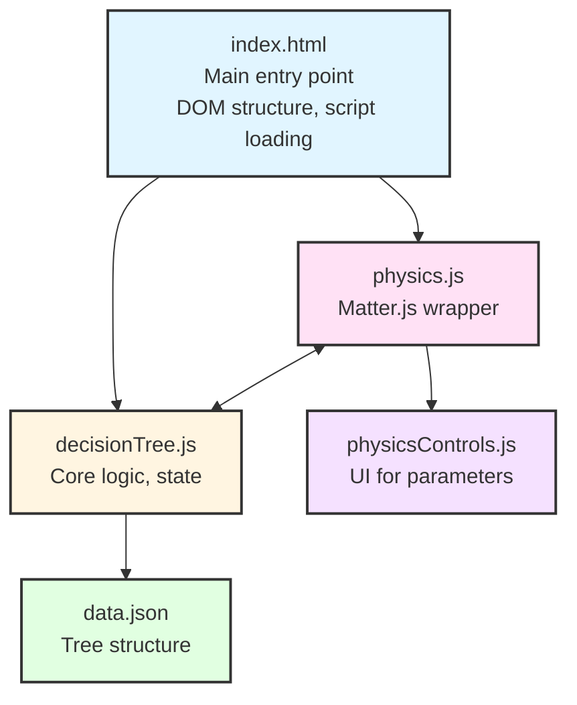

# Technical Documentation

**Descriptor Selection Tool - Complete Technical Reference**

*For programmers and technical contributors*

---

## Table of Contents

1. [System Architecture](#system-architecture)
2. [Core Modules](#core-modules)
3. [Data Structures](#data-structures)
4. [Physics Engine Deep Dive](#physics-engine-deep-dive)
5. [Event Flow & State Management](#event-flow--state-management)
6. [API Reference](#api-reference)
7. [Configuration & Customization](#configuration--customization)
8. [Design Patterns & Best Practices](#design-patterns--best-practices)

---

## System Architecture

### Overview

The application is a single-page interactive decision tree with physics-based visualization. It uses a multi-parent, multi-child graph structure where user choices trigger visual elements (balls) that interact via 2D physics simulation.

### Component Diagram



### Function Flow Diagram

Complete function-level architecture showing initialization, event flow, and interactions:

```mermaid
graph TD
    subgraph "Application Lifecycle"
        START([Page Load]) --> DOM_READY[DOMContentLoaded Event]
        DOM_READY --> LOAD_DATA[Load data.json]
        LOAD_DATA --> CREATE_TREE[new DecisionTree]
        CREATE_TREE --> TREE_INIT[DecisionTree.init]
        TREE_INIT --> BUILD_PARENTS[_buildParentRelationships]
        TREE_INIT --> VALIDATE[Validate tree structure]
        
        DOM_READY --> PHYSICS_INIT[PhysicsEngine.init]
        PHYSICS_INIT --> CREATE_ENGINE[Engine.create]
        PHYSICS_INIT --> CREATE_RENDER[Render.create]
        PHYSICS_INIT --> CREATE_WALLS[createWalls]
        PHYSICS_INIT --> ATTACH_EVENTS[Attach beforeUpdate/afterUpdate]
        
        PHYSICS_INIT --> PHYSICS_START[PhysicsEngine.start]
        PHYSICS_START --> RUNNER_RUN[Runner.run]
        
        DOM_READY --> CONTROLS_INIT[PhysicsControls.init]
        CONTROLS_INIT --> LOAD_CONFIG[Load from localStorage]
        CONTROLS_INIT --> SETUP_SLIDERS[setupSlider × N]
        CONTROLS_INIT --> SETUP_RANGES[setupRangeSlider × N]
        
        DOM_READY --> DOCS_INIT[DocsPanel.init]
        DOM_READY --> SHORTCUTS_INIT[ShowHide.init]
        
        DOM_READY --> RENDER_INITIAL[renderChoices - initial]
    end
    
    subgraph "DecisionTree Core API"
        TREE_INIT --> GET_CHOICE[getChoice id]
        TREE_INIT --> GET_CHILDREN[getChildren parentId]
        TREE_INIT --> GET_PARENTS[getParents id]
        TREE_INIT --> GET_PARENT_IDS[getParentIds id]
        TREE_INIT --> GET_PARENT_NAME[getParentName id]
        TREE_INIT --> GET_INITIAL[getInitial]
        TREE_INIT --> GET_CHILD_COUNT[getChildCount parentId]
    end
    
    subgraph "User Interaction Flow"
        USER_CLICK([User clicks choice]) --> CHOICE_HANDLER{Choice Handler}
        CHOICE_HANDLER --> EXTRACT_ID[Extract choice ID]
        EXTRACT_ID --> ADD_HISTORY[Add to navigationHistory]
        ADD_HISTORY --> CHECK_CHILDREN{Has children?}
        
        CHECK_CHILDREN -->|Yes| ADD_SELECT[Add to selectList]
        ADD_SELECT --> TRIGGER_BALL[PhysicsEngine.addBall]
        TRIGGER_BALL --> CALC_RADIUS[calculateBallRadius]
        TRIGGER_BALL --> BODIES_CIRCLE[Bodies.circle]
        TRIGGER_BALL --> SET_VELOCITY[Body.setVelocity]
        TRIGGER_BALL --> SET_ANGULAR[Body.setAngularVelocity]
        TRIGGER_BALL --> ADD_WORLD[Composite.add to world]
        ADD_SELECT --> RENDER_NEXT[renderChoices - children]
        
        CHECK_CHILDREN -->|No - Leaf| HIDE_CHOICES[Hide choices]
        HIDE_CHOICES --> SHOW_VALIDATION[Show validation buttons]
        SHOW_VALIDATION --> GRAVITY_SEQ[Start gravity sequence]
        GRAVITY_SEQ --> TIMEOUT_3S[setTimeout 3s]
        TIMEOUT_3S --> SET_REVERSED[setMode 'reversed']
        SET_REVERSED --> TIMEOUT_5S[setTimeout 5s]
        TIMEOUT_5S --> SET_ZERO[setMode 'zeroGravity']
        SET_ZERO --> DIAGNOSTIC[diagnosticCheck]
        SET_ZERO --> MONITOR[monitorEnergy]
        
        BACK_CLICK([User clicks back]) --> BACK_HANDLER{Back Handler}
        BACK_HANDLER --> POP_HISTORY[Pop navigationHistory]
        POP_HISTORY --> CHECK_HAD_BALL{hadBall flag?}
        CHECK_HAD_BALL -->|true| REMOVE_SELECT[Remove from selectList]
        REMOVE_SELECT --> REMOVE_BALL[PhysicsEngine.removeLastBall]
        REMOVE_BALL --> SIN_HOLE{Normal mode?}
        SIN_HOLE -->|Yes| DISABLE_COLLISION[Disable collisions]
        DISABLE_COLLISION --> APPLY_FORCE[Body.applyForce downward]
        APPLY_FORCE --> TRACK_FALLING[Add to fallingBalls]
        SIN_HOLE -->|No| IMMEDIATE_REMOVE[Composite.remove]
        CHECK_HAD_BALL -->|false| NAVIGATE_BACK[Navigate to previousNodeId]
        NAVIGATE_BACK --> RESET_MODE[Reset to normal mode]
        
        RESTART_CLICK([User clicks restart]) --> RESTART_HANDLER{Restart Handler}
        RESTART_HANDLER --> CLEAR_STATE[Clear all state arrays]
        CLEAR_STATE --> CLEAR_BALLS[PhysicsEngine.clearBalls]
        CLEAR_BALLS --> RESET_INITIAL[Reset to initial node]
    end
    
    subgraph "Physics Engine Loop - 60 FPS"
        RUNNER_RUN --> BEFORE_UPDATE[beforeUpdate event]
        BEFORE_UPDATE --> STORE_SPEEDS[Store pre-collision speeds]
        BEFORE_UPDATE --> CONFIG_PAIRS[Configure collision pairs]
        BEFORE_UPDATE --> ENGINE_UPDATE[Engine.update]
        
        ENGINE_UPDATE --> BROADPHASE[Broadphase detection]
        BROADPHASE --> NARROWPHASE[Narrowphase SAT]
        NARROWPHASE --> RESOLVE_COLLISION[Resolve impulses]
        RESOLVE_COLLISION --> POSITION_CORRECT[Position correction]
        
        POSITION_CORRECT --> AFTER_UPDATE[afterUpdate event]
        AFTER_UPDATE --> APPLY_THRESHOLD{Threshold enabled?}
        APPLY_THRESHOLD -->|Yes| CHECK_VELOCITY{v < threshold?}
        CHECK_VELOCITY -->|Yes| STOP_BALL[Set velocity to zero]
        APPLY_THRESHOLD -->|No| CAP_MAX[Cap maximum velocity]
        AFTER_UPDATE --> CLEANUP_FALLEN[Cleanup fallingBalls]
        
        AFTER_UPDATE --> RENDER[Render.world]
        RENDER --> AFTER_RENDER[afterRender event]
        AFTER_RENDER --> DRAW_LABELS[Draw text labels on balls]
        DRAW_LABELS --> WORD_WRAP[Apply word wrapping]
        DRAW_LABELS --> ROTATE_TEXT[Rotate with ball angle]
        
        AFTER_RENDER --> RUNNER_RUN
    end
    
    subgraph "Physics Mode System"
        SET_MODE[setMode modeName, options]
        SET_MODE --> GET_MODE_CONFIG[Get MODES config]
        GET_MODE_CONFIG --> UPDATE_GRAVITY[setGravity]
        GET_MODE_CONFIG --> UPDATE_FRICTION[setFriction]
        GET_MODE_CONFIG --> UPDATE_BOUNCE[setBounciness]
        GET_MODE_CONFIG --> APPLY_TO_BALLS[Update all ball properties]
        GET_MODE_CONFIG --> APPLY_TO_WALLS[Update all wall properties]
        SET_MODE --> RANDOM_VEL{randomVelocities?}
        RANDOM_VEL -->|Yes| SET_RANDOM[setRandomVelocities]
        
        MODE_NORMAL[Normal Mode<br/>gravity: 1.0<br/>threshold: 0.01]
        MODE_REVERSED[Reversed Mode<br/>gravity: -0.04<br/>threshold: 0.01]
        MODE_ZERO[Zero Gravity<br/>gravity: 0<br/>threshold: disabled]
    end
    
    subgraph "Configuration System"
        SETUP_SLIDERS --> SLIDER_INPUT[addEventListener 'input']
        SLIDER_INPUT --> UPDATE_DISPLAY[Update value display]
        SLIDER_INPUT --> CALL_CALLBACK[Call change callback]
        CALL_CALLBACK --> SET_CONFIG[PhysicsEngine.setConfig]
        SET_CONFIG --> SAVE_LOCAL[Save to localStorage]
        
        EXPORT_BTN([Export button]) --> EXPORT_SETTINGS[exportSettings]
        EXPORT_SETTINGS --> GET_CONFIG[PhysicsEngine.getConfig]
        GET_CONFIG --> JSON_STRINGIFY[JSON.stringify]
        JSON_STRINGIFY --> CREATE_BLOB[Create Blob]
        CREATE_BLOB --> TRIGGER_DOWNLOAD[Trigger download]
        
        IMPORT_BTN([Import button]) --> IMPORT_FILE[Read JSON file]
        IMPORT_FILE --> PARSE_JSON[JSON.parse]
        PARSE_JSON --> APPLY_CONFIG[Apply to engine]
    end
    
    subgraph "Window Events"
        RESIZE([Window resize]) --> UPDATE_CANVAS[Update canvas dimensions]
        UPDATE_CANVAS --> ADJUST_BALLS[adjustBallPositions]
        ADJUST_BALLS --> CONSTRAIN_BOUNDS[Constrain to new bounds]
        ADJUST_BALLS --> DAMPEN_VEL[Dampen velocities]
        UPDATE_CANVAS --> RECREATE_WALLS[Recreate walls with new size]
        
        KEY_ENTER([Press Enter]) --> TOGGLE_FULLSCREEN[Toggle fullscreen]
        KEY_TAB([Press Tab]) --> TOGGLE_PANELS[Toggle control panels]
    end
    
    subgraph "Rendering & Visualization"
        RENDER_CHOICES[renderChoices nodeId]
        RENDER_CHOICES --> GET_NODE[DecisionTree.getChoice]
        GET_NODE --> GET_KIDS[DecisionTree.getChildren]
        GET_KIDS --> CREATE_BUTTONS[Create choice buttons]
        CREATE_BUTTONS --> APPEND_DOM[Append to #choices]
        CREATE_BUTTONS --> ATTACH_HANDLERS[Attach click handlers]
        
        DRAW_LABELS --> GET_CONTEXT[Get canvas 2D context]
        GET_CONTEXT --> SET_FONT[Set font properties]
        SET_FONT --> MEASURE_TEXT[measureText]
        MEASURE_TEXT --> SPLIT_WORDS{Width > threshold?}
        SPLIT_WORDS -->|Yes| WRAP_LINES[Split into multiple lines]
        SPLIT_WORDS -->|No| DRAW_SINGLE[Draw single line]
        WRAP_LINES --> DRAW_MULTI[Draw multiple lines]
    end
    
    subgraph "Data Flow & State"
        DATA_JSON[data.json] --> TREE_DATA[DecisionTree.data]
        TREE_DATA --> CHOICES_MAP[choices object]
        TREE_DATA --> INITIAL_ARRAY[initial array]
        
        STATE_CURRENT[current_id] --> TRACK_NODE[Current node]
        STATE_STEP[step counter] --> TRACK_PROGRESS[Progress tracking]
        STATE_SELECT[selectList array] --> TRACK_SELECTED[Selected choices]
        STATE_HISTORY[navigationHistory array] --> TRACK_PATH[Full path with metadata]
        STATE_TRIGGERED[triggeredBalls Set] --> PREVENT_DUPES[Prevent duplicates]
        STATE_MODE[physicsMode boolean] --> TOGGLE_PHYSICS[Enable/disable]
        
        STATE_SELECT -.Invariant.-> BALLS_ARRAY[PhysicsEngine.balls]
        STATE_SELECT -.Must Equal.-> STATE_TRIGGERED
    end
    
    %% Cross-module connections
    STATE_SELECT ==>|Read/Write| ADD_SELECT
    STATE_HISTORY ==>|Read/Write| ADD_HISTORY
    STATE_TRIGGERED ==>|Check| TRIGGER_BALL
    TRACK_NODE ==>|Navigate| CHOICE_HANDLER
    
    RUNNER_RUN ==>|Drives| TRIGGER_BALL
    AFTER_RENDER ==>|Updates| RENDER_NEXT
    STOP_BALL ==>|Affects| REMOVE_BALL
    
    ADJUST_BALLS ==>|Repositions| TRIGGER_BALL
    TOGGLE_PANELS ==>|Controls UI| RENDER_CHOICES
    
    RENDER_CHOICES ==>|Generates| USER_CLICK
    ATTACH_HANDLERS ==>|Enables| CHOICE_HANDLER
    
    SET_MODE ==>|Changes Physics| GRAVITY_SEQ
    SET_RANDOM ==>|Modifies| TRIGGER_BALL
    
    SET_CONFIG ==>|Updates Engine| RUNNER_RUN
    APPLY_CONFIG ==>|Configures| PHYSICS_INIT
    
    style START fill:#90EE90
    style USER_CLICK fill:#FFD700
    style BACK_CLICK fill:#FFD700
    style RESTART_CLICK fill:#FFD700
    style RUNNER_RUN fill:#87CEEB
    style AFTER_RENDER fill:#87CEEB
    style DATA_JSON fill:#98FB98
```



**Key Function Categories:**

1. **Initialization** (Top): Page load → Module initialization → Engine setup
2. **User Events** (Left): Click handlers → State updates → Physics triggers
3. **Physics Loop** (Center): 60 FPS update/render cycle with collision detection
4. **Mode System** (Right): Three physics modes with different parameters
5. **Configuration** (Bottom-Right): Slider controls and import/export
6. **Data Flow** (Bottom): State management and critical invariants

**Critical Paths:**
- **Choice Selection**: User click → Add to history → Trigger ball → Render next choices
- **Physics Update**: beforeUpdate → Engine.update → afterUpdate → Render → afterRender (60 times/sec)
- **Mode Transitions**: End of tree → Normal (3s) → Reversed (2s) → Zero Gravity (perpetual)

### Technology Stack

- **Runtime**: Browser (ES6+ JavaScript)
- **DOM Manipulation**: jQuery 3.6.0
- **Physics Engine**: Matter.js 0.19.0 (2D rigid body physics)
- **Module System**: ES6 modules (import/export)
- **Storage**: localStorage for persistence
- **Animation**: CSS animations + Matter.js physics

### File Structure & Responsibilities

```
lib/
├── decisionTree.js       # Core decision tree logic, navigation, state management
├── physics.js            # Physics engine wrapper, ball rendering, modes
├── physicsControls.js    # UI controls for physics parameters, config persistence
├── showHide.js           # Keyboard shortcuts (fullscreen, panel toggles)
├── docsPanel.js          # Documentation panel loader
└── data.json             # Decision tree data structure

css/
├── dashboard.css         # Main UI styles
├── physics-controls.css  # Physics control panel styles
├── docs-panel.css        # Documentation panel styles
├── fonts.css             # Font definitions
├── title.css             # Title animations
└── animate.css           # CSS animation library

index.html                # Main HTML entry point
docs-viewer.html          # Markdown documentation viewer
```

---

## Core Modules

### 1. decisionTree.js

**Purpose**: Implements the decision tree data structure and navigation logic.

#### Class: `DecisionTree`

**Constructor**:
```javascript
var DecisionTree = function (data) {
  this.initial = data.initial;      // Array of initial node IDs
  this.choices = data.choices;      // Object map: id -> choice node
  this.data = data;                 // Full data object
  
  this._buildParentRelationships(); // Build reverse edges
  this.init();                      // Validate structure
}
```

**Key Methods**:

- **`_buildParentRelationships()`**
  - Builds reverse edges (parent pointers) from children references
  - Dynamically constructs `parents` array for each node
  - Ensures graph integrity for multi-parent scenarios

- **`init()`**
  - Validates tree structure (no duplicate IDs)
  - Sets up node IDs on choice objects
  - Checks for conflicting parent relationships
  - Throws errors on structural problems

- **`getChoice(id)`**
  - Returns choice object by ID
  - Throws error if ID not found
  - Primary accessor for node data

- **`getChildren(parentId)`**
  - Returns array of child choice objects
  - Returns empty array if no children
  - Used for navigation and rendering

- **`getParents(id)` / `getParentIds(id)`**
  - Returns parent choice objects or IDs
  - Supports multi-parent navigation
  - Used by back button logic

- **`getInitial()`**
  - Returns initial choice nodes (entry points)
  - Always returns array (can have multiple starting points)

#### State Management

The UI logic (in jQuery document.ready) maintains:

```javascript
var current_id = null;           // Currently displayed node
var step = 0;                    // Step counter
var selectList = [];             // User's selected choices (displayed as balls)
var navigationHistory = [];      // Full navigation path with metadata
var triggeredBalls = new Set();  // Track which balls have been added (prevents duplicates)
var physicsMode = true;          // Toggle state (physics vs static display)
```

**Navigation History Structure**:
```javascript
navigationHistory = [
  {
    nodeId: "choiceId",          // ID of the choice node
    previousNodeId: "parentId",  // Where we came from (or null for initial)
    step: 1,                     // Step number when this choice was made
    hadBall: true                // Whether this choice triggered a ball
  },
  // ... more entries
]
```

**Critical Invariant**: `selectList.length === balls.length === triggeredBalls.size`

This ensures that the visual representation (balls) always matches the user's choice history.

#### Event Handlers

**Choice Click Handler**:
```javascript
$(document).on("click", "#choices li, #choices a", function (e) {
  // 1. Extract choice ID from data-choice attribute
  // 2. Add to navigation history
  // 3. Check if node has children (excluding "end" node)
  // 4. If has children: add to selectList, trigger ball, render children
  // 5. If leaf node: hide choices, show final validation, trigger gravity sequence
  // 6. Update UI state (show back button, update title)
});
```

**Back Button Logic**:
```javascript
$("#back").on("click", function (e) {
  // 1. Pop last entry from navigationHistory
  // 2. Check hadBall flag
  // 3. If hadBall: remove from selectList, trigger ball removal (sin-hole effect)
  // 4. Navigate back to previousNodeId
  // 5. Render previous node's children
  // 6. Reset physics mode to normal
});
```

**Restart Button**:
```javascript
$("#restart").on("click", function (e) {
  // 1. Clear all state (selectList, navigationHistory, triggeredBalls)
  // 2. Clear physics balls
  // 3. Reset to initial node
  // 4. Reset physics mode to normal
});
```

### 2. physics.js

**Purpose**: Wrapper around Matter.js for ball physics simulation.

#### Module Pattern

Uses revealing module pattern (IIFE returning public API):

```javascript
var PhysicsEngine = (function () {
  "use strict";
  
  // Private state
  var engine = null;
  var render = null;
  var runner = null;
  var balls = [];
  var walls = [];
  var fallingBalls = [];
  var isActive = false;
  var currentMode = 'normal';
  
  // Public API
  return {
    init: init,
    start: start,
    stop: stop,
    addBall: addBall,
    removeLastBall: removeLastBall,
    clearBalls: clearBalls,
    setMode: setMode,
    // ... more methods
  };
})();
```

#### Matter.js Integration

**Engine Configuration**:
```javascript
engine = Engine.create({
  gravity: { x: 0, y: config.gravity },
  enableSleeping: false,           // Balls never auto-sleep
  constraintIterations: 2,
  positionIterations: 10,          // High precision for collision resolution
  velocityIterations: 8            // Energy conservation in collisions
});
```

**Rendering**:
- Canvas-based rendering via `Matter.Render`
- Custom `afterRender` event for text labels
- Text drawn centered in balls, rotates with ball angle
- Word wrapping for long text

**Physics Loop**:
- Fixed timestep: 60 FPS (16.667ms per frame)
- `beforeUpdate`: Configure collision pairs, track pre-collision speeds
- `afterUpdate`: Apply velocity thresholds, cap max speed, cleanup fallen balls

#### Ball Management

**Ball Creation** (`addBall(text, colorIndex)`):
```javascript
var ball = Bodies.circle(x, y, radius, {
  restitution: config.bounciness,    // Elasticity (0-1+)
  friction: ballFriction,            // Surface friction
  frictionAir: ballFrictionAir,     // Air resistance
  frictionStatic: ballFrictionStatic,
  density: 0.001,                    // Mass = density × area
  sleepThreshold: Infinity,          // Never sleep
  render: { fillStyle: color }
});

// Custom properties (not Matter.js standard)
ball.label = labelText;              // Text to display
ball.ballColor = color;              // Ball color
ball.ballRadius = radius;            // Ball radius (for text sizing)

// Initial velocity
Body.setVelocity(ball, { x: vx, y: vy });
Body.setAngularVelocity(ball, angularVel);
```

**Ball Sizing Algorithm**:
```javascript
// Calculate radius from screen area percentage
function calculateBallRadius(percentage) {
  var screenArea = window.innerWidth * window.innerHeight;
  var baseRadius = Math.sqrt((screenArea * percentage) / Math.PI);
  var randomFactor = 0.8 + Math.random() * 0.4;  // ±20% variation
  var radius = baseRadius * randomFactor;
  return Math.max(30, Math.min(800, radius));    // Clamp to [30, 800]
}
```

**Ball Removal** (`removeLastBall()`):
- **Normal mode**: Sin-hole effect (ball falls through floor)
  - Disable collisions with walls
  - Apply strong downward force
  - Remove when off-screen
- **Other modes**: Immediate removal

#### Physics Modes

Three distinct modes with different physics parameters:

**1. Normal Gravity**:
```javascript
normal: {
  name: 'Normal Gravity',
  gravity: 1.0,
  friction: 0.05,
  frictionAir: 0.01,
  bounciness: 0.95,
  velocityThreshold: 0.01,
  enableThreshold: true
}
```
- Standard Earth-like gravity
- Balls bounce and eventually settle
- Used during active navigation

**2. Reversed Gravity (Damped)**:
```javascript
reversed: {
  name: 'Reversed Gravity (Damped)',
  gravity: -0.04,
  friction: 0.05,
  frictionAir: 0.01,
  bounciness: 0.95,
  velocityThreshold: 0.01,
  enableThreshold: true
}
```
- Gentle upward float
- Balls rise slowly and settle at top
- Part of end-of-tree animation sequence

**3. Zero Gravity (Billiard Table)**:
```javascript
zeroGravity: {
  name: 'Zero Gravity (Billiard Table)',
  gravity: 0,
  friction: 0.05,
  frictionAir: 0,              // No air resistance = perpetual motion
  frictionStatic: 0.05,
  bounciness: 0.98,
  velocityThreshold: 0,
  enableThreshold: false       // Never stop balls
}
```
- No gravity, no air resistance
- Balls bounce forever (energy conserved)
- Friction converts linear momentum to angular momentum (spin)
- End-of-tree final state (perpetual motion display)

#### Gravity Sequence (End of Tree)

When user reaches final node:

```javascript
// Step 1: Wait 3 seconds in normal mode
setTimeout(() => {
  // Step 2: Switch to reversed gravity (gentle upward float)
  PhysicsEngine.setMode('reversed', { 
    randomVelocities: { min: -2, max: 2 } 
  });
}, 3000);

// Step 3: After 5 seconds total, switch to zero gravity
setTimeout(() => {
  PhysicsEngine.setMode('zeroGravity', { 
    randomVelocities: { min: -1.5, max: 1.5 } 
  });
  PhysicsEngine.diagnosticCheck();
  PhysicsEngine.monitorEnergy(3000);
}, 5000);
```

#### Wall System

Four static walls (floor, ceiling, left, right):

```javascript
function createWalls() {
  var wallThickness = 200;  // Thick walls prevent tunneling
  var w = canvas.width;
  var h = canvas.height;

  // Floor - inner surface at y = h
  var floor = Bodies.rectangle(
    w / 2, 
    h + wallThickness / 2, 
    w + wallThickness * 2, 
    wallThickness, 
    { isStatic: true, restitution: config.bounciness, friction: config.friction }
  );
  
  // Similar for ceiling (y = 0), left (x = 0), right (x = w)
  // ...
}
```

Walls are repositioned on window resize to match new canvas dimensions.

### 3. physicsControls.js

**Purpose**: UI controls for real-time physics parameter adjustment.

#### Configuration System

**Default Configuration**:
```javascript
const defaults = {
  ballSizePercent: 0.06,
  velocityX: { min: -20, max: 20 },
  velocityY: { min: 8.5, max: 10 },
  bounciness: 1,
  friction: 0.05,
  gravity: 1,
  textSizeFactor: 0.22,
  allCaps: true,
  velocityThreshold: 0.01,
  canvasBorder: true
};
```

**Persistence**: Configuration saved to localStorage under key `'physicsConfig'`.

#### Slider System

**Single Slider Pattern**:
```javascript
function setupSlider(sliderId, valueId, formatFn, changeFn) {
  const slider = document.getElementById(sliderId);
  const valueDisplay = document.getElementById(valueId);
  
  slider.addEventListener('input', function() {
    // Real-time update: display + apply to physics engine
    valueDisplay.textContent = formatFn(slider.value);
    changeFn(slider.value);
  });
}
```

**Range Slider Pattern** (min/max pairs):
```javascript
function setupRangeSlider(minId, minValueId, maxId, maxValueId, changeFn) {
  // Two sliders for min/max values
  // Both update displays and call changeFn in real-time
  // Used for velocity ranges (X and Y)
}
```

**Available Controls**:
- Ball Size (% of screen area)
- Velocity X Range (min/max horizontal velocity)
- Velocity Y Range (min/max vertical velocity)
- Bounciness (restitution coefficient)
- Friction (surface friction)
- Gravity (vertical acceleration)
- Text Size (as factor of ball radius)
- Text All Caps (boolean)
- Text White Color (boolean)
- Velocity Threshold (minimum velocity before stop)
- Canvas Border (debug visualization)

#### Export/Import System

**Export Settings**:
```javascript
function exportSettings() {
  const currentConfig = PhysicsEngine.getConfig();
  const jsonString = JSON.stringify(currentConfig, null, 2);
  const blob = new Blob([jsonString], { type: 'application/json' });
  // Trigger download with timestamp filename
}
```

### 4. showHide.js

**Purpose**: Keyboard shortcuts for UI control.

**Implemented Shortcuts**:
- **Enter/Return**: Toggle fullscreen mode
- **Tab**: Toggle both control panels (physics + docs) visibility

### 5. docsPanel.js

**Purpose**: Documentation panel for in-app reference.

**Features**:
- Lists all markdown documentation files
- Opens docs in new tab via `docs-viewer.html`
- Synchronized with Tab key toggle (handled in decisionTree.js)

---

## Data Structures

### Decision Tree Data Format (data.json)

**Top-level Structure**:
```json
{
  "initial": ["start"],
  "choices": {
    "nodeId": { /* choice node */ },
    // ...
  }
}
```

### Choice Node Structure

```json
{
  "choice": "Display text for button",
  "stepTitle": "Question/prompt shown at top",
  "children": ["childId1", "childId2"],
  "result": "final-descriptor",     // Only for leaf nodes
  "parents": ["parentId1"]          // Auto-generated, don't specify manually
}
```

**Field Definitions**:

- **`choice`** (string, required): Button text shown to user
- **`stepTitle`** (string, optional): Title/question shown when node is active. Falls back to `choice` if not specified.
- **`children`** (array of strings, optional): IDs of child nodes. Empty/missing for leaf nodes.
- **`result`** (string, optional): Final result descriptor. Only used for leaf nodes.
- **`parents`** (array of strings, auto-generated): Parent node IDs. Built automatically by `_buildParentRelationships()`.

### Graph Properties

- **Multi-parent**: A node can have multiple parents (converging paths)
- **Multi-child**: A node can have multiple children (branching paths)
- **Acyclic**: No cycles allowed (enforced by navigation logic)
- **Tree-like**: Despite multi-parent support, navigation maintains tree-like history

### Special Nodes

**"start" node**:
- Entry point of the tree
- Listed in `initial` array
- Has no parents

**"end" node**:
- Optional terminal node
- When a node has only "end" as child, it's treated as final state
- Used to trigger end-of-tree animation sequence

### Navigation History Structure

```javascript
{
  nodeId: "string",          // ID of current node
  previousNodeId: "string",  // ID of parent node (or null for initial)
  step: number,              // Step number in navigation
  hadBall: boolean           // Whether this navigation triggered a ball
}
```

**`hadBall` Flag Logic**:
- `true`: User selected a choice that has children → ball was added
- `false`: User clicked "Start" button or navigated to node without adding ball
- Used by back button to know whether to remove a ball

---

## Physics Engine Deep Dive

### Matter.js Core Concepts

**Rigid Body Physics**:
- All objects (balls, walls) are rigid bodies (no deformation)
- Collisions use impulse-based resolution
- Energy conservation controlled by restitution coefficient

**Key Properties**:
- **Mass**: Calculated from density × area. All balls have same density (0.001).
- **Inertia**: Rotational mass, calculated from mass and shape (circle).
- **Restitution**: Elasticity (1.0 = perfect bounce, 0 = no bounce)
- **Friction**: Resistance to sliding at contact points
- **FrictionAir**: Velocity damping (air resistance)
- **FrictionStatic**: Resistance to starting motion from rest

### Collision Resolution

**Solver Configuration**:
```javascript
engine.positionIterations = 10;    // Position correction passes
engine.velocityIterations = 8;     // Velocity correction passes
engine.constraintIterations = 2;   // Constraint resolution passes
```

Higher iterations = more accurate collisions, but slower performance.

**Collision Phases**:
1. **Broadphase**: Quick check for potential collisions (spatial partitioning)
2. **Narrowphase**: Precise collision detection (SAT algorithm)
3. **Resolution**: Calculate impulses, update velocities
4. **Position Correction**: Fix penetration (prevents sinking)

### Energy Management

**Energy Conservation**:
- Perfect elasticity (restitution = 1.0) conserves kinetic energy
- Real-world: some energy lost to friction and numerical errors
- Zero-gravity mode minimizes losses (frictionAir = 0, high restitution)

**Energy Monitoring** (debug feature):
```javascript
PhysicsEngine.monitorEnergy(interval);  // Log total energy every `interval` ms
```

Calculates:
- Linear kinetic energy: ½mv²
- Angular kinetic energy: ½Iω²
- Total energy (should be constant in zero-gravity)

### Rotation & Spin

**Angular Velocity**:
- Balls rotate based on collisions (friction converts linear → angular momentum)
- Initial angular velocity: small random spin for visual interest
- Natural rotation emerges from physics (not scripted)

**Friction's Role**:
- At contact point, friction force acts tangentially
- Creates torque → angular acceleration
- Higher friction = more spin transfer in collisions

### Velocity Thresholds

**Problem**: Balls can bounce infinitely with tiny velocities (micro-bouncing).

**Solution**: Velocity threshold
```javascript
if (speed < mode.velocityThreshold && speed > 0) {
  Body.setVelocity(ball, { x: 0, y: 0 });
  Body.setAngularVelocity(ball, 0);
}
```

**Mode-specific**:
- Normal/Reversed: `velocityThreshold = 0.01` (balls can stop)
- Zero Gravity: `enableThreshold = false` (balls never stop)

### Sin-Hole Effect (Ball Removal Animation)

**Implementation**:
```javascript
function removeLastBall() {
  if (currentMode === 'normal') {
    // Disable collisions with walls
    Body.set(lastBall, {
      collisionFilter: {
        category: 0x0002,
        mask: 0x0000  // Collides with nothing
      }
    });
    
    // Apply strong downward force
    Body.applyForce(lastBall, lastBall.position, { 
      x: 0, 
      y: lastBall.mass * 0.02 
    });
    
    // Remove friction for smooth fall
    Body.set(lastBall, {
      friction: 0,
      frictionAir: 0.001,
      restitution: 0
    });
    
    // Track as falling (will be removed when off-screen)
    fallingBalls.push(lastBall);
  }
}
```

**Cleanup** (in `afterUpdate` event):
```javascript
fallingBalls.forEach(function(ball) {
  if (ball.position.y > canvasHeight + ball.ballRadius * 2) {
    Composite.remove(engine.world, ball);
    // Remove from fallingBalls array
  }
});
```

### Canvas Resizing

**On window resize**:
1. Update canvas dimensions
2. Adjust ball positions (if outside new bounds)
3. Recreate walls with new dimensions
4. Dampen velocities (only in threshold-enabled modes)

**Position Adjustment**:
```javascript
function adjustBallPositions(oldWidth, oldHeight, newWidth, newHeight) {
  balls.forEach(function(ball) {
    // If ball is outside new boundaries, constrain position
    if (outsideBounds(ball)) {
      var newPos = constrainToBounds(ball);
      Body.setPosition(ball, newPos);
      // Dampen velocity to prevent extreme bouncing (non-zero-gravity modes)
      if (mode.enableThreshold) {
        Body.setVelocity(ball, { 
          x: ball.velocity.x * 0.5, 
          y: ball.velocity.y * 0.5 
        });
      }
    }
  });
}
```

---

## Event Flow & State Management

### Application Lifecycle

```
1. Page Load
   ├─ DOM ready event fires
   ├─ Load decision tree data (localStorage or fetch)
   ├─ Create DecisionTree instance
   └─ Initialize UI

2. Physics Engine Initialization
   ├─ Create Matter.js engine
   ├─ Create renderer
   ├─ Create walls
   ├─ Start runner (60 FPS)
   └─ Attach event handlers (beforeUpdate, afterUpdate, afterRender)

3. UI Initialization
   ├─ Load physics config from localStorage
   ├─ Apply config to controls (sliders, checkboxes)
   ├─ Render initial choice buttons
   ├─ Auto-enable physics mode
   └─ Hide control panels

4. User Interaction Loop
   ├─ User clicks choice button
   ├─ Add to navigation history
   ├─ Add to selectList (if has children)
   ├─ Trigger ball creation (physics mode)
   ├─ Render next choices
   └─ Update UI state

5. End of Tree
   ├─ Hide choices
   ├─ Show validation buttons
   ├─ Animate nav control to bottom
   └─ Trigger gravity sequence (3s → reversed, 5s → zero)

6. Back Navigation
   ├─ Pop navigation history
   ├─ Check hadBall flag
   ├─ If hadBall: remove from selectList, trigger sin-hole effect
   ├─ Navigate to previous node
   └─ Reset physics mode to normal

7. Restart
   ├─ Clear all state
   ├─ Clear physics balls
   ├─ Reset to initial node
   └─ Reset physics mode
```

### State Synchronization Points

**Critical Sync Points**:
1. **Choice Click**: Add to `navigationHistory`, `selectList`, `triggeredBalls`, physics balls
2. **Back Click**: Pop from `navigationHistory`, `selectList`, `triggeredBalls`, physics balls
3. **Mode Change**: Update all balls' physics properties (friction, restitution, gravity)
4. **Config Change**: Update `PhysicsEngine` config, save to localStorage

### Event Handler Relationships

```
User Action → jQuery Event → State Update → Physics Update → Visual Update
    ↓             ↓              ↓               ↓               ↓
  Click      click handler   selectList      addBall()      Render loop
                             navHistory      setMode()      (afterRender)
```

### Physics Loop Events

**`beforeUpdate`**:
- Store pre-collision speeds (for energy tracking)
- Configure collision pairs (zero-gravity mode: prevent sticking)
- Adjust solver parameters

**`afterUpdate`**:
- Apply velocity thresholds (stop slow balls in normal/reversed modes)
- Enforce minimum velocity (keep balls moving in zero-gravity)
- Cap maximum velocity (prevent wall tunneling)
- Clean up fallen balls (sin-hole effect)

**`afterRender`**:
- Draw text labels on balls
- Apply word wrapping
- Handle text rotation (follows ball angle)

---

## API Reference

### DecisionTree API

#### Constructor

```javascript
new DecisionTree(data)
```

**Parameters**:
- `data` (object): Tree data structure with `initial` and `choices` properties

**Throws**: Error if data is invalid or tree structure has issues

#### Methods

**`getChoice(id)`**
```javascript
var choice = tree.getChoice("nodeId");
```
Returns choice object by ID. Throws error if not found.

**`getChildren(parentId)`**
```javascript
var children = tree.getChildren("parentId");
// Returns: [{ id: "child1", choice: "...", ... }, ...]
```
Returns array of child choice objects. Empty array if no children.

**`getParents(id)` / `getParentIds(id)`**
```javascript
var parents = tree.getParents("nodeId");
var parentIds = tree.getParentIds("nodeId");
```
Returns parent choice objects or IDs. Empty array if no parents.

**`getParentName(id)`**
```javascript
var parentName = tree.getParentName("nodeId");
// Returns: "Parent Title" or false
```
Returns stepTitle of first parent (for display). False if no parents.

**`getInitial()`**
```javascript
var initial = tree.getInitial();
// Returns: [{ id: "start", choice: "Start", ... }]
```
Returns array of initial choice objects.

**`getChildCount(parentId)`**
```javascript
var count = tree.getChildCount("parentId");
```
Returns number of children for a node.

### PhysicsEngine API

#### Core Methods

**`init()`**
```javascript
PhysicsEngine.init();
// Returns: true if successful, false otherwise
```
Initializes Matter.js engine, renderer, walls. Call once before `start()`.

**`start()`**
```javascript
PhysicsEngine.start();
```
Starts physics simulation and rendering. Shows canvas.

**`stop()`**
```javascript
PhysicsEngine.stop();
```
Stops physics simulation and rendering. Hides canvas.

#### Ball Management

**`addBall(text, colorIndex)`**
```javascript
var ball = PhysicsEngine.addBall("Choice Text", 2);
// Returns: Matter.js Body object
```
Creates and adds a ball to the simulation.

**Parameters**:
- `text` (string): Text label to display on ball
- `colorIndex` (number, optional): Index into `ballColors` array. Defaults to `balls.length % ballColors.length`.

**Returns**: Matter.js Body object with custom properties (`label`, `ballColor`, `ballRadius`)

**`removeLastBall()`**
```javascript
PhysicsEngine.removeLastBall();
```
Removes most recently added ball. In normal mode: sin-hole effect. Other modes: immediate removal.

**`clearBalls()`**
```javascript
PhysicsEngine.clearBalls();
```
Removes all balls from simulation.

#### Physics Parameter Control

**`setGravity(value)`**
```javascript
PhysicsEngine.setGravity(1.5);
```
Sets gravity value. Positive = down, negative = up, 0 = none.

**`setFriction(friction, frictionAir)`**
```javascript
PhysicsEngine.setFriction(0.05, 0.01);
```
Sets friction on all balls and walls.

**`setBounciness(value)`**
```javascript
PhysicsEngine.setBounciness(0.95);
```
Sets restitution (elasticity) on all balls and walls.

**`setRandomVelocities(velocityRange)`**
```javascript
PhysicsEngine.setRandomVelocities({ min: -3, max: 3 });
```
Applies random velocities to all balls. Used for scatter effects.

#### Mode Control

**`setMode(modeName, options)`**
```javascript
PhysicsEngine.setMode('zeroGravity', { 
  randomVelocities: { min: -1.5, max: 1.5 } 
});
```

**Parameters**:
- `modeName` (string): One of `'normal'`, `'reversed'`, `'zeroGravity'`
- `options` (object, optional):
  - `randomVelocities` (object): `{ min, max }` for velocity randomization

**Available Modes**:
- `'normal'`: Standard gravity, balls can stop
- `'reversed'`: Gentle upward float, balls can stop
- `'zeroGravity'`: No gravity, perpetual motion

#### Configuration

**`setConfig(config)`**
```javascript
PhysicsEngine.setConfig({
  ballSizePercent: 0.06,
  bounciness: 0.95,
  friction: 0.05
});
```
Updates physics configuration. Can set partial config (only specified keys).

**`getConfig()`**
```javascript
var config = PhysicsEngine.getConfig();
```
Returns current configuration object.

#### Debug/Diagnostic Methods

**`diagnosticCheck()`**
```javascript
PhysicsEngine.diagnosticCheck();
```
Logs diagnostic information (ball velocities, physics settings).

**`monitorEnergy(interval)`**
```javascript
PhysicsEngine.monitorEnergy(3000);  // Log every 3 seconds
```
Starts energy monitoring (logs total kinetic energy). Useful for verifying energy conservation.

---

## Configuration & Customization

### Physics Configuration Object

```javascript
{
  ballSizePercent: 0.06,        // Ball size as % of screen area (0.001-0.06)
  velocityX: {                  // Initial horizontal velocity range
    min: -20,
    max: 20
  },
  velocityY: {                  // Initial vertical velocity range
    min: 8.5,
    max: 10
  },
  bounciness: 1,                // Restitution coefficient (0-2)
  friction: 0.05,               // Surface friction (0-0.2)
  frictionAir: 0.01,            // Air resistance (0-0.1)
  gravity: 1.0,                 // Gravity strength (0-3)
  textSizeFactor: 0.22,         // Font size as proportion of ball radius (0.1-0.5)
  allCaps: true,                // Display text in all caps
  whiteText: false,             // Use white text color (default: black)
  velocityThreshold: 0.01,      // Min velocity before ball stops (0-0.1)
  canvasBorder: true            // Show red debug border on canvas
}
```

### Customizing Ball Colors

Edit `ballColors` array in physics.js:

```javascript
var ballColors = [
  "rgb(242, 255, 99)",  // Yellow
  "rgb(99, 211, 255)",  // Blue
  "rgb(229, 128, 240)", // Purple
  "rgb(255, 180, 99)",  // Orange
  "rgb(99, 255, 187)",  // Green
  "rgb(243, 118, 155)", // Pink
  "rgb(211, 255, 99)",  // Lime
  "rgb(180, 150, 255)", // Lavender
];
```

Colors cycle through array using `balls.length % ballColors.length`.

### Adding New Physics Modes

1. Add mode configuration to `MODES` object in physics.js:

```javascript
MODES.myMode = {
  name: 'My Custom Mode',
  gravity: 0.5,
  friction: 0.02,
  frictionAir: 0.005,
  frictionStatic: 0.02,
  bounciness: 0.9,
  velocityThreshold: 0.005,
  enableThreshold: true
};
```

2. Call via `PhysicsEngine.setMode('myMode')`.

### Customizing Gravity Sequence

Edit timing and modes in decisionTree.js choice click handler:

```javascript
// After reaching final node
setTimeout(function() {
  PhysicsEngine.setMode('reversed', { randomVelocities: { min: -2, max: 2 } });
}, 3000);  // Delay before reversed gravity

setTimeout(function() {
  PhysicsEngine.setMode('zeroGravity', { randomVelocities: { min: -1.5, max: 1.5 } });
}, 5000);  // Delay before zero gravity
```

### Styling Customization

**Ball styles**: Edit `render` options in `Bodies.circle()` call in `addBall()`.

**UI styles**: Edit CSS files:
- `dashboard.css`: Main UI, choice buttons
- `physics-controls.css`: Control panel
- `docs-panel.css`: Documentation panel
- `title.css`: Title animations

**Text rendering**: Edit `afterRender` event handler in physics.js:
- Font family: `context.font = "bold " + fontSize + "px Arial, sans-serif"`
- Text color: `context.fillStyle = config.whiteText ? "#fff" : "#000"`
- Word wrapping threshold: `if (metrics.width > radius * 1.5)`

### Keyboard Shortcuts

Edit `showHide.js` and decisionTree.js:

**Current shortcuts**:
- Enter: Fullscreen toggle
- Tab: Panel visibility toggle

**To add new shortcuts**, add event handlers in document keydown listener:

```javascript
$(document).on("keydown", function(e) {
  if (e.key === "YourKey") {
    e.preventDefault();
    // Your action
  }
});
```

---

## Design Patterns & Best Practices

### 1. Module Pattern (Revealing Module)

**Used in**: physics.js

**Pattern**:
```javascript
var PhysicsEngine = (function () {
  "use strict";
  
  // Private variables and functions
  var privateVar = "private";
  function privateFunction() { /* ... */ }
  
  // Public API
  return {
    publicMethod: publicMethod,
    // ...
  };
})();
```

**Benefits**:
- Encapsulation: Private state not accessible from outside
- Namespace: Single global variable
- Clear API surface

### 2. Constructor Pattern

**Used in**: decisionTree.js

**Pattern**:
```javascript
var DecisionTree = function (data) {
  this.initial = data.initial;
  this.choices = data.choices;
  this.init();
};

DecisionTree.prototype.getChoice = function (id) {
  // Method implementation
};
```

**Benefits**:
- Instance-based: Can create multiple tree instances
- Prototype methods: Shared across instances (memory efficient)
- Clear constructor/initializer

### 3. Event-Driven Architecture

**Used throughout**: jQuery events, Matter.js events

**Pattern**:
```javascript
// Attach listeners
$(document).on("click", "#selector", function(e) {
  // Handler logic
});

Events.on(engine, "beforeUpdate", function() {
  // Physics logic
});

// Events trigger state changes
// State changes trigger visual updates
```

**Benefits**:
- Decoupling: Components don't directly call each other
- Flexibility: Easy to add/remove event handlers
- Maintainability: Clear data flow

### 4. State Synchronization Pattern

**Used in**: decisionTree.js (navigation history)

**Pattern**:
```javascript
// Critical invariant: selectList.length === balls.length
// All state updates maintain this invariant

function addChoice(choiceId) {
  // 1. Update navigation history
  navigationHistory.push({...});
  
  // 2. Update selection list
  selectList.push(choiceId);
  
  // 3. Update visual representation
  PhysicsEngine.addBall(choiceId);
  
  // 4. Update tracking set
  triggeredBalls.add(choiceId);
}
```

**Benefits**:
- Consistency: All related state updated atomically
- Debuggability: Single source of truth
- Correctness: Invariants enforced

### 5. Configuration Object Pattern

**Used in**: physicsControls.js, physics.js

**Pattern**:
```javascript
// Single config object
var config = {
  param1: value1,
  param2: value2,
  // ...
};

// Partial updates
function setConfig(partialConfig) {
  Object.assign(config, partialConfig);
}
```

**Benefits**:
- Flexibility: Easy to add new parameters
- Serialization: Single object to save/load
- Testability: Easy to set up test configurations

### 6. Callback/Observer Pattern

**Used in**: physicsControls.js slider setup

**Pattern**:
```javascript
function setupSlider(sliderId, valueId, formatFn, changeFn) {
  slider.addEventListener('input', function() {
    valueDisplay.textContent = formatFn(slider.value);
    changeFn(slider.value);  // Callback on change
  });
}
```

**Benefits**:
- Reusability: Generic slider setup function
- Separation: Display logic separate from business logic
- Flexibility: Different callbacks for different sliders

### 7. Error Handling Strategy

**Validation at boundaries**:
```javascript
// Constructor validates input
var DecisionTree = function (data) {
  if (!data || typeof data !== "object") {
    throw new Error("DecisionTree: Invalid data structure provided");
  }
  // ...
};

// Methods validate preconditions
DecisionTree.prototype.getChoice = function (id) {
  if (!(id in this.choices)) {
    throw new Error(`DecisionTree: Choice "${id}" not found`);
  }
  return this.choices[id];
};
```

**Benefits**:
- Fail fast: Errors caught early
- Clear messages: Easy debugging
- Type safety: Runtime validation

### 8. Data Flow Architecture

```
Data → State → View
 ↑              ↓
 └─── Events ←──┘
```

**Implementation**:
1. **Data**: data.json (immutable after load)
2. **State**: selectList, navigationHistory, current_id
3. **View**: DOM rendering, physics visualization
4. **Events**: User clicks, physics updates

**Best Practice**: Unidirectional data flow prevents circular dependencies and makes debugging easier.

### 9. Performance Optimizations

**Canvas rendering**:
- Fixed timestep (60 FPS) for consistent physics
- Single `afterRender` event handler (not per-ball)
- Word wrap caching could be improved (currently recalculates each frame)

**Physics optimization**:
- High iteration counts for accuracy (may reduce FPS with many balls)
- Sleep disabled (prevents deactivation of slowly moving balls)
- Spatial partitioning via Matter.js (automatic)

**DOM optimization**:
- Event delegation: `$(document).on("click", "#choices a", ...)` instead of per-button handlers
- Minimize reflows: Batch DOM updates

### 10. Debugging Best Practices

**Console logging**:
- Descriptive messages: "Ball falling through floor (sin-hole effect)"
- State dumps: Log navigationHistory, selectList on major state changes
- Physics diagnostics: `diagnosticCheck()`, `monitorEnergy()`

**Debug features**:
- Canvas border toggle (visualize physics boundaries)
- Physics controls panel (real-time parameter tweaking)
- Energy monitoring (verify physics correctness)

**Error messages**:
- Include context: "DecisionTree: Choice \"xyz\" not found"
- Actionable: Tell developer what went wrong and where

---

## Additional Technical Notes

### Browser Compatibility

**Required features**:
- ES6 modules (import/export)
- Fetch API
- localStorage
- Canvas 2D context
- Fullscreen API (optional, degrades gracefully)

**Tested browsers**:
- Chrome/Edge 90+
- Firefox 88+
- Safari 14+

**Known issues**:
- Fullscreen API requires user gesture (security restriction)
- localStorage can fail if user has disabled cookies/storage

### Performance Considerations

**Physics simulation**:
- Scales linearly with number of balls (O(n) for updates)
- Collision detection: O(n²) worst case, O(n log n) with spatial partitioning
- Recommended max: ~50 balls for smooth 60 FPS

**DOM rendering**:
- Choice button rendering: O(n) where n = number of children
- Text rendering in canvas: O(balls.length) per frame
- Potential optimization: Cache word-wrapped text

### Memory Management

**Potential leaks**:
- Event handlers: Properly cleaned up on restart
- Matter.js bodies: Removed from world via `Composite.remove()`
- Falling balls: Cleaned up after falling off-screen

**localStorage usage**:
- Decision tree data: ~10-50 KB (depends on tree size)
- Physics config: ~1 KB
- Total: Negligible for modern browsers (quota: 5-10 MB)

### Future Enhancement Ideas

**Planned features for upcoming releases:**

1. **Choice Scoring System**
   - Add score/weight values to each choice node
   - Calculate cumulative scores through decision paths
   - Display final score on tree completion
   - Support multiple scoring dimensions (e.g., cost, risk, quality)
   - Visual indicators for high/low scoring paths
   - Export score reports

2. **Visual Node Graph Editor**
   - Interactive visualization of the decision tree structure from data.json
   - Display nodes as graph vertices with edges showing relationships
   - Real-time graph layout (force-directed, hierarchical, or radial)
   - Pan, zoom, and navigate large tree structures
   - Highlight current path and available choices
   - Collapsible/expandable node groups

3. **In-Browser Graph Editor**
   - Drag-and-drop node creation and positioning
   - Visual editing of node properties (choice text, stepTitle, result)
   - Add/remove parent-child relationships by connecting nodes
   - Real-time validation of graph structure (no cycles, valid connections)
   - Undo/redo functionality
   - Export edited graph back to data.json format
   - Import/merge existing decision trees

---

## Conclusion

This technical documentation provides a comprehensive reference for developers working with the Descriptor Selection Tool codebase. The architecture is modular, event-driven, and built on solid physics simulation principles.

**Key Takeaways**:
- **DecisionTree**: Manages graph structure and navigation logic
- **PhysicsEngine**: Wraps Matter.js for visual ball simulation
- **State Management**: Navigation history + select list + triggered balls = consistent state
- **Physics Modes**: Three distinct modes for different visual effects
- **Event-Driven**: Clear separation between data, state, and view layers

**For Contributors**:
- Follow existing patterns (module, constructor, event-driven)
- Maintain state invariants (selectList.length === balls.length)
- Test physics changes in all three modes
- Log state changes for debuggability
- Document any new configuration parameters

**Questions or Issues**: Refer to changelog.md for recent changes, or examine console logs for runtime diagnostics.

---

**Last Updated**: August 28, 2026  
**Version**: 2.0  
**Author**: ddelcourt
